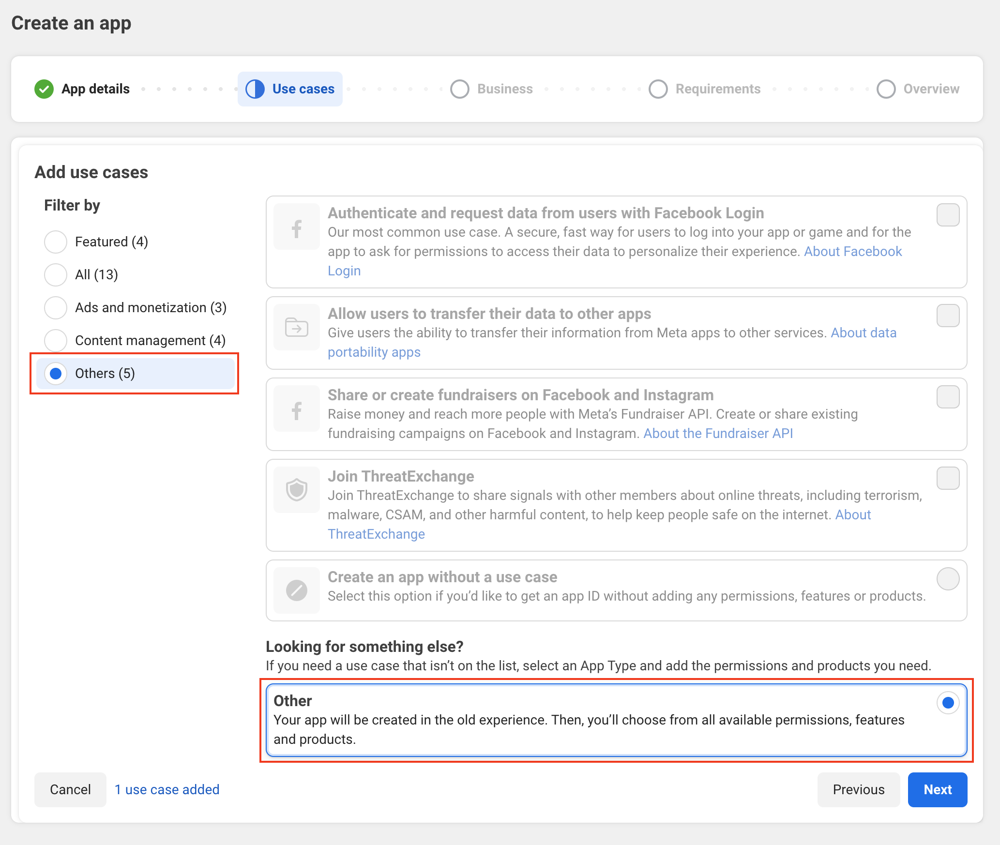
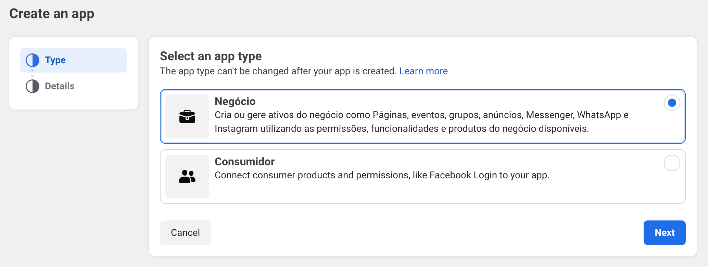
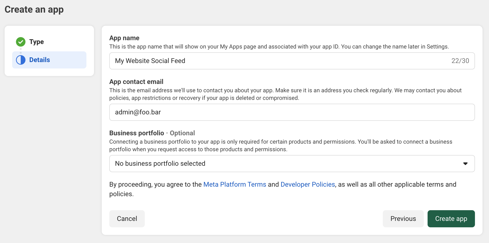
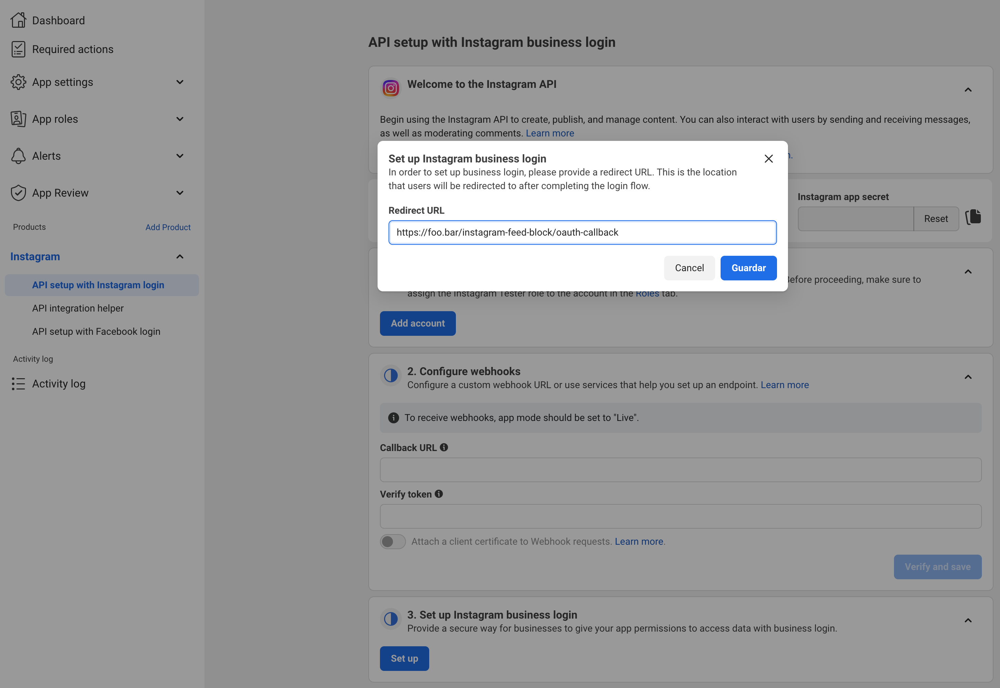

# Outstand Instagram Feed

> Display Instagram posts using a customizable Gutenberg block with list and grid layouts.

## Description

A WordPress plugin that connects to the Instagram API to display your Instagram posts in the block editor. It handles OAuth authentication, automatic token refresh, and provides modular blocks for media and captions with full layout and styling controls.

The icons are from [Themify Icons](https://themify.me/themify-icons).


## Features

- **OAuth Authentication**: Connects to the Instagram API with automatic long-lived token refresh
- **List and Grid Layouts**: Choose how your feed is displayed
- **Modular Blocks**: Separate blocks for media, captions, and post templates
- **Full Styling Support**: Colors, typography, spacing, borders, and overlay controls
- **Built-in Caching**: 5-minute transient cache for optimal performance

## Installation

### Manual Installation

1. Download the plugin ZIP file from the GitHub repository.
2. Go to Plugins > Add New > Upload Plugin in your WordPress admin area.
3. Upload the ZIP file and click Install Now.
4. Activate the plugin.

### Install with Composer

To include this plugin as a dependency in your Composer-managed WordPress project:

1. Add the plugin to your project using the following command:

```bash
composer require outstand/instagram-feed
```

2. Run `composer install` to install the plugin.
3. Activate the plugin from your WordPress admin area or using WP-CLI.

## Setup

> You'll connect your Instagram Business or Creator account to your website using a Facebook App. This allows the plugin to fetch and display your Instagram feed securely.

### Account Requirements

- Your Instagram account must be a **Business** or **Creator** account
- To convert your account: [How to switch to a professional Instagram account](https://help.instagram.com/502981923235522)

### Step 1: Create App

> All Instagram API access goes through the Facebook Developers platform. You'll create a Facebook App that connects to your Instagram Business or Creator account.

1. Go to [Facebook Developers Portal](https://developers.facebook.com/apps/) and click **Create App**
2. Enter your app name (e.g., "My Website Social Feed" or "Company Social Media") and your contact email address
   
3. Click **Next**
4. Under **Filter by**, choose **Others**, then select **Other** as the use case and click **Next**
   
5. Select **Business** as app type and click **Next**
   
6. Click **Create app**
   

### Step 2: Configure App

1. Go to **App settings** > **Basic**:
    - Add your **Privacy Policy URL** and **Terms of Service URL**
    - Add your website domain to **App domains**: `yourdomain.com`
    - Click **Save changes**
   
2. In the app dashboard, under **Products**, click **Set up** in **Instagram**
   
3. Copy your **Instagram App ID** and **Instagram App Secret** (Do NOT use the credentials from **App settings** > **Basic**)
   
4. Click **Set up** under **Set up Instagram business login**
5. Add the following **Redirect URL** (replace yourdomain.com with your site's domain): `https://yourdomain.com/outstand-instagram-feed/oauth-callback`
   
6. Click **Save**
7. Go to **App Roles** > **Roles**
8. Click **Add People**
   
9. Select **Instagram Tester** role
10. Search for the account connected to your Instagram and click **Add**
   
11. The person must accept the invitation:
    - Go to Instagram
    - Go to **Settings** > **Apps and websites** > **Tester Invites**
    - Accept the invitation

### Step 3: Configure Plugin

1. Go to **Settings > Outstand Instagram Feed** in your WordPress admin
2. Enter your **Instagram App ID** and **Instagram App Secret** and click **Save**
3. Click **Connect Instagram Account**
4. You will be redirected to Instagram where you can log in with your username and password
5. After login, you will see a permissions window. The only permission required is **View profile and access media**. All others you can leave unchanged or toggle off.
6. Click **Allow**
7. You'll be redirected back to WordPress. Your connection will appear as **Connected** in the plugin settings.

### Step 4: Add the Block

1. In the block editor, search for "Instagram Feed"
2. Add the block to your page or post
3. Configure the number of posts to display
4. Choose your preferred layout (list or grid)

## Usage

### Instagram Feed

The main block controls the overall feed settings:

- **Number of Posts**: Set how many Instagram posts to display (1-50)
- **Layout**: Choose between list and grid layouts
- **Alignment**: Support for wide and full-width alignments

### Child Blocks

- **Post Template**: Container for individual Instagram posts with full layout and styling support
- **Post Media**: Displays the Instagram image with link, dimension, overlay, border, and shadow controls
- **Post Caption**: Shows the post caption with heading level, alignment, link, and typography options

## Requirements

- WordPress 6.7 or higher
- PHP 8.2 or higher
- Instagram **Business** or **Creator** account
- Facebook Developer account with Instagram product configured

## Changelog

All notable changes to this project are documented in [CHANGELOG.md](https://github.com/outstand-labs/outstand-instagram-feed/blob/main/CHANGELOG.md).

## License

This project is licensed under the [GPL-3.0-or-later](https://spdx.org/licenses/GPL-3.0-or-later.html).
