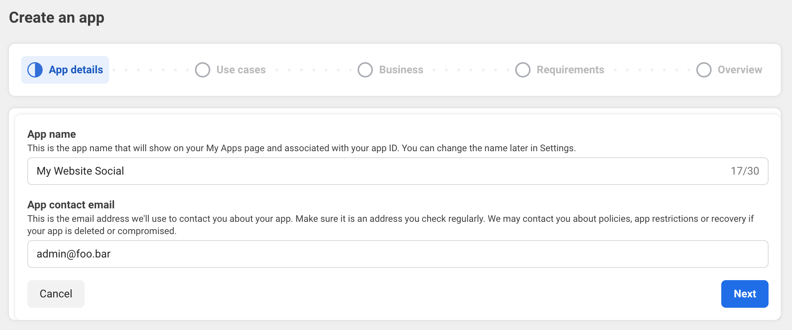
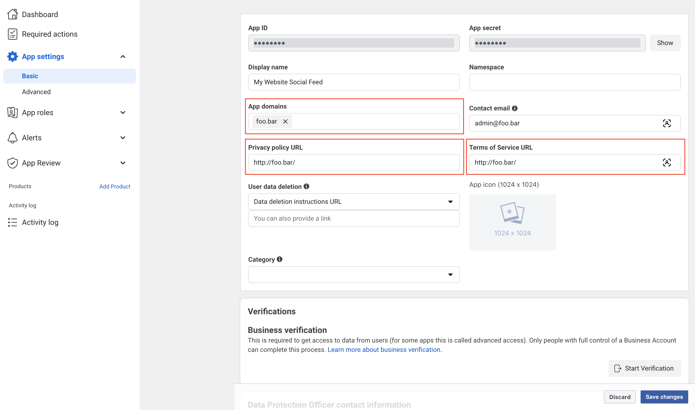
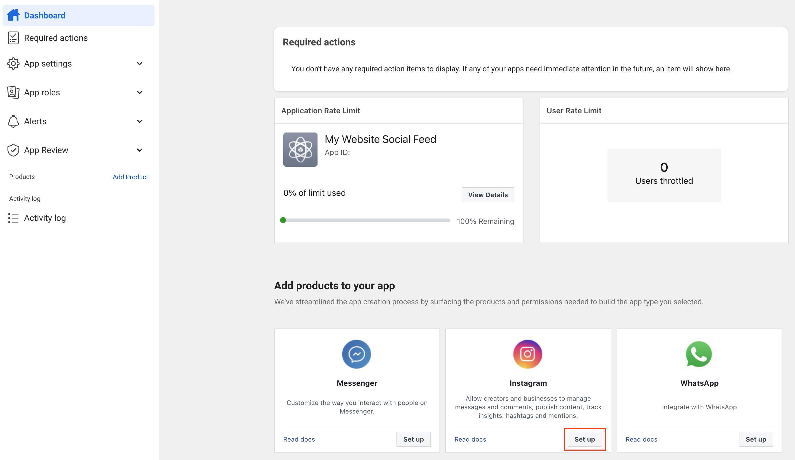
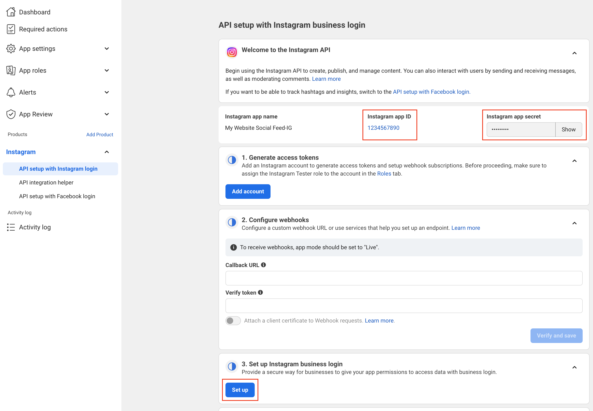
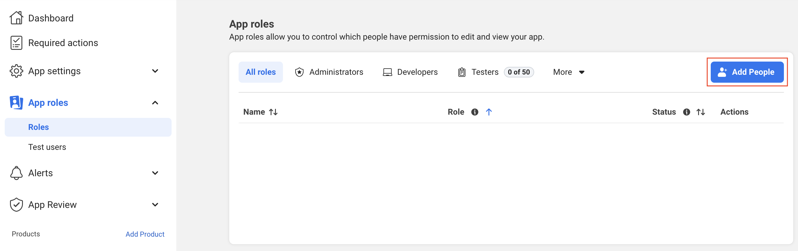
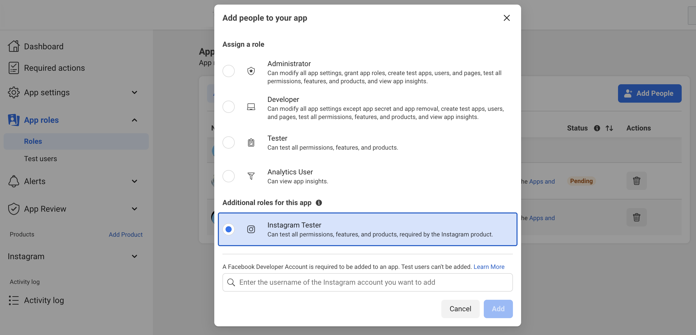

# Registering Your Facebook App

This guide walks through the one-time Facebook App and Instagram Business
login configuration required before the plugin can fetch your Instagram feed.

## Prerequisites

- Your Instagram account must be a **Business** or **Creator** account.
  Personal accounts are not supported.
  How to switch: [Instagram Help — switch to a professional account](https://help.instagram.com/502981923235522).
- You must be an admin of the WordPress site where the plugin will run.
- You need the site's public domain (e.g. `your-domain.com`).

## Step 1 — Create the Facebook App

1. Go to the [Facebook Developers Portal](https://developers.facebook.com/apps/) and click **Create App**.
2. Enter your app name (e.g. "My Website Social Feed" or "Company Social Media") and your contact email.
   
3. Click **Next**.
4. Under **Filter by**, choose **Others**, then select **Other** as the use case and click **Next**.
   
5. Select **Business** as the app type and click **Next**.
   
6. Click **Create app**.
   

## Step 2 — Configure the Facebook App

1. Go to **App settings → Basic**:
    - Add your **Privacy Policy URL** and **Terms of Service URL**.
    - Add your website domain to **App domains**: `your-domain.com`.
    - Click **Save changes**.
   
2. In the app dashboard, under **Products**, click **Set up** in **Instagram**.
   
3. Copy your **Instagram App ID** and **Instagram App Secret**.

   > Do **NOT** use the credentials from **App settings → Basic** — those are
   > for the Facebook App itself, not the Instagram product.

   
4. Click **Set up** under **Set up Instagram business login**.
5. Add the following **Redirect URL**, replacing `your-domain.com` with the site's real domain:

   ```
   https://your-domain.com/outstand-instagram-feed/oauth-callback
   ```

   This is the OAuth callback URL the plugin handles. It must match exactly — including the `https://`, the domain, and the path — or Instagram will reject the login.
   
6. Click **Save**.
7. Go to **App Roles → Roles**.
8. Click **Add People**.
   
9. Select **Instagram Tester** role.
10. Search for the Instagram account you want to connect and click **Add**.
    
11. The Instagram account holder must accept the invitation:
    - Open Instagram.
    - Go to **Settings → Apps and websites → Tester Invites**.
    - Accept the invitation.

## Step 3 — Next: WordPress

You now have:

- A Facebook App configured for Instagram business login.
- An **Instagram App ID** and **Instagram App Secret** (copied from Step 2.3).
- An approved Instagram Tester account connected to the app.

Return to the main [README](../README.md) and continue with **Step 2: Configure Plugin**.

## Troubleshooting

**"Invalid OAuth redirect URI" error during login**
The Redirect URL entered in Step 2.5 does not exactly match the one the plugin uses. Re-check: `https://your-domain.com/outstand-instagram-feed/oauth-callback` — same scheme, same domain, same path.

**"User is not a tester" error during login**
The Instagram account was invited but the invitation was never accepted. Go to Instagram → Settings → Apps and websites → Tester Invites, accept, then retry.

**"Invalid App ID" error**
You copied the credentials from **App settings → Basic** instead of from the Instagram product page. Go back to Step 2.3 and use the Instagram App ID + Secret.

**App stuck in "Development Mode"**
For personal use with yourself as Instagram Tester, Development Mode is fine — the app does not need to be submitted for App Review. Only switch to Live Mode if you plan to let other people (outside your Tester list) connect their own Instagram accounts.
